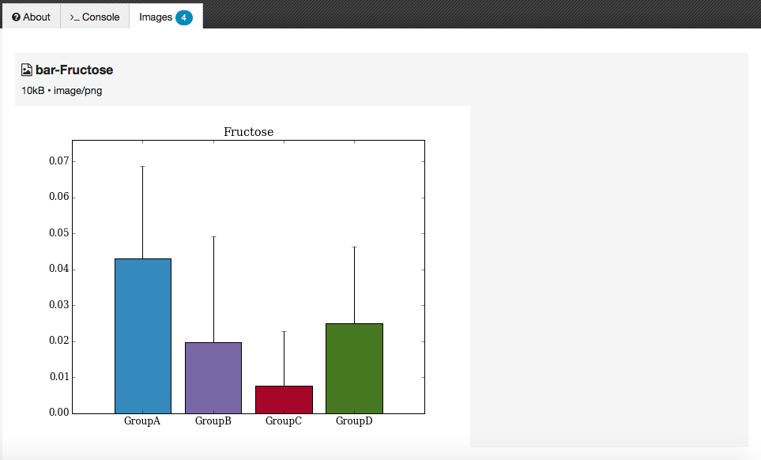

Wooey
=====

Automated web UIs for Python scripts

## About

Wooey is a simple web interface (built on Flask) to run command line Python scripts. Think of it as an easy way to get
your scripts up on the web for routine data analysis, file processing, or anything else.

The name deirved from [Gooey](https://github.com/chriskiehl/Gooey) a GUI-from-command-line tool for Python scripts. In fact
the ArgumentParser to JSON conversion is almost a direct copy from this project at present.

The front page of a wooey install presents a list of installed scripts:

Each script has it's own UI form based on the config parameters defined in the ArgumentParser:

Documentation can be specified either manually via the JSON, or my providing a
[Markdown](http://en.wikipedia.org/wiki/Markdown)-format file alongside the script or config file.

Logged-in users get a nice listing of their previous jobs:

The output from successful jobs is available via an inline viewer (images only presently, .csv support via Pandas to follow):

Errors are output to the inline console:

## Quickstart

First, set your app's secret key as an environment variable. For example, example add the following to ``.bashrc`` or ``.bash_profile``.

    export WOOEY_SECRET='something-really-secret'

Then run the following commands to bootstrap your environment.

    git clone https://github.com/mfitzp/wooey
    cd wooey
    pip install -r requirements/dev.txt
    python manage.py server

You will see a pretty welcome screen.

Once you have installed your DBMS, run the following to create your app's database tables and perform the initial migration:

    python manage.py db init
    python manage.py db migrate
    python manage.py db upgrade
    python manage.py server

The server will start up. But you will see it is empty! To add the example scripts to the database and allow you to test
also run:

    python manage.py build_scripts
    python manage.py find_scripts

This will build (create JSON for Python scripts using argparse) and then add them to the database.

In another shell, you can start the temporary dev 'daemon' (which is nothing of the sort, yet) using:

    python manage.py start_daemon

Deployment
----------

In your production environment, make sure the ``WOOEY_ENV`` environment variable is set to ``"prod"``.

Shell
-----

To open the interactive shell, run ::

    python manage.py shell

By default, you will have access to ``app``, ``db``, and the ``User`` model. This can be used to quickly recreate database tables
during development, i.e. delete `dev.db` (SQLite) and then from the shell enter:

    db.create_all()

Running Tests
-------------

To run all tests, run ::

    python manage.py test

Migrations
----------

Whenever a database migration needs to be made. Run the following commmands:
::

    python manage.py db migrate

This will generate a new migration script. Then run:
::

    python manage.py db upgrade

To apply the migration.

For a full migration command reference, run ``python manage.py db --help``.
