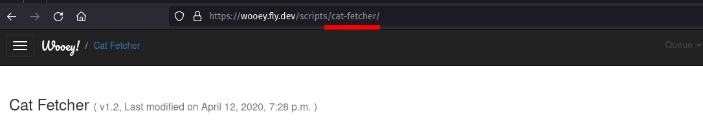

Wooey API
=========

Wooey's API allows for programmatic access to manage scripts as well as submit and query jobs.
All use of the API requires a user to be authenticated via :ref:`API keys <api_keys>` and
the API to be enabled by setting `WOOEY_ENABLE_API_KEYS` in your user_settings.py file.

Script Management API
~~~~~~~~~~~~~~~~~~~~~

Adding and updating a script use the same endpoint, **api/scripts/v1/add-or-update/**.

.. code-block:: python

    import requests

    response = requests.post(
      'https://wooey.fly.dev/api/scripts/v1/add-or-update/',
      data={
        "group": "The script group", # optional
        "script-name": open("path_to_script.py", "rb")
      },
      headers={'Authorization': 'Bearer your_token_here'},
    )

For updating an existing script, the same code can be used with the new version. By default,
updating a script will make that version the default version to run for submissions. To disable
this, add `default: False` to the payload. Multiple scripts can be uploaded at once by simply
providing multiple files. The name of the script is the key used for the file. Thus, for this example
our script name would be `script-name`.

Job API
~~~~~~~

Creating a new Job
##################

A script can be ran via the **api/scripts/v1/<script_slug>/submit/** endpoint. A `script_slug` is the
script name, with any invalid url characters removed. This will normally be the lowercase version of the
script's name, but can be found by looking at the url of a given script.

.. code-block:: python

    import requests

    response = requests.post(
      'https://wooey.fly.dev/api/scripts/v1/cat-fetcher/submit/',
      data={
        "job_name": "test job",
        "command": "--count 5 --breed bengal"
      },
      headers={'Authorization': 'Bearer your_token_here'},
    )

    # A valid response will contain
    data = response.json()
    # {"job_id": 123, "valid": True}

For jobs that require files, the uploaded file can be provided and referenced in the `command` parameter. For example:

.. code-block:: python

    import requests

    response = requests.post(
      'https://wooey.fly.dev/api/scripts/v1/protein-translation/submit/',
      data={
        "job_name": "test job",
        "command": "--fasta protein_sequences"
      },
      files={
        "protein_sequences": open('./proteins.fasta')
      },
      headers={'Authorization': 'Bearer your_token_here'},
    )

Currently, this is only supported if the parameter is marked as a filetype (such as `here <https://docs.python.org/3/library/argparse.html#filetype-objects>`_).

Querying Jobs
#############

A job can be queried by its id. While the UI allows sharing and management of jobs via a shareable UUID, that
currently does not exist for Wooey's API as there is no public access permitted. **Importantly, these requests
are GET requests**

There are 2 endpoints for querying: **api/jobs/v1/<job_id>/status/** and **api/jobs/v1/<job_id>/details/**.

**api/jobs/v1/<job_id>/status/** will provide information if the job is complete and should be used for polling.
Once the job is complete, **api/jobs/v1/<job_id>/details/** will provide rich details about the job, including
all assets generated by it and URLs to programatically download assets.

.. code-block:: python

    import requests

    requests.get(
      'https://wooey.fly.dev/api/jobs/v1/123/status/',
      headers={'Authorization': 'Bearer your_token_here'},
    )
    # {"status": "running", "is_complete": False}
    ...
    requests.get(
      'https://wooey.fly.dev/api/jobs/v1/123/status/',
      headers={'Authorization': 'Bearer your_token_here'},
    )
    # {"status": "completed", "is_complete": True}
    requests.get(
      'https://wooey.fly.dev/api/jobs/v1/123/details/',
      headers={'Authorization': 'Bearer your_token_here'},
    )
    # {
    #    "status": "completed",
    #    "is_complete": True,
    #    "job_name": "test job",
    #    "job_description": "",
    #    "assets": [{"name": "assert 1", "url": "https://...", ...}],
    #    "stdout": "This job's output, errors and other information would appear here",
    #    "stderr": "This job's error output, errors and other information would appear here",
    #    "uuid": "The sharable UUID, this can be used to provide someone a permalink to the UI view of the Job"
    # }

.. toctree::
   :maxdepth: 1

   api_keys
