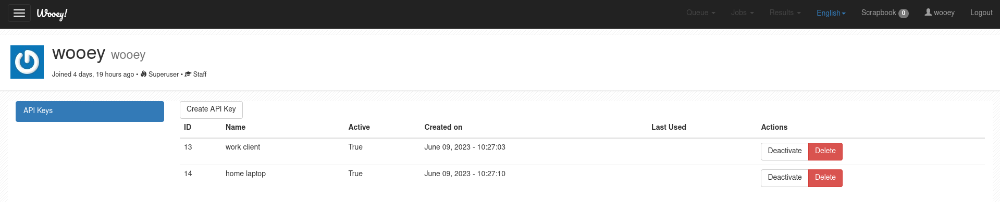

API Keys
========

API Keys allows authentication to Wooey for remote access, such as through an
automated job runner.

API Keys can be managed and accessed via the User Profile interface

From here, a user can create a new API key, toggle the status of an API key, or delete it.
During creating, a modal window will provide the API key. This is the only time this key will
be shown, as it is stored in the database as a hash.

Example Usage
-------------

Here is a simple example of how to set the API key credentials in the request header:

  .. code-block:: python

    import requests

    response = requests.post('https://wooey.fly.dev/xxx', headers={'Authorization': 'Bearer your_token_here'})
