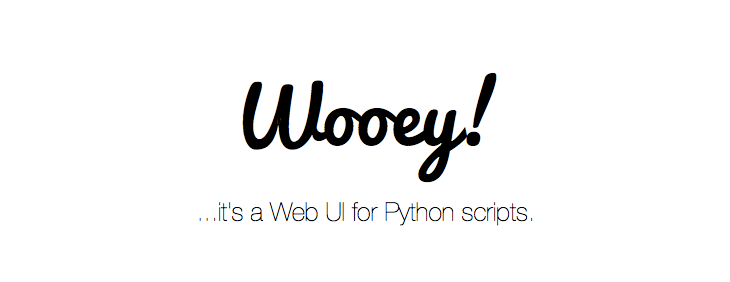

Welcome to Wooey's documentation
================================

Wooey is a simple web interface to run command line Python scripts. Think of it as an easy way to get your scripts
up on the web for routine data analysis, file processing, or anything else.

The project was inspired by how simply and powerfully
`sandman <https://github.com/jeffknupp/sandman>`__ could expose users to
a database and by how `Gooey <https://github.com/chriskiehl/Gooey>`__
turns ArgumentParser-based command-line scripts into WxWidgets GUIs.
Originally two separate projects (Django-based djangui by `Chris
Mitchell <https://github.com/Chris7>`__ and Flask-based Wooey by `Martin
Fitzpatrick <https://github/mfitzp>`__) it has been merged to combine
our efforts.

Both of our tools were based on our needs as data scientists to have a
system that could:

1. Autodocument workflows for data analysis (simple model saving).
2. Enable fellow lab members with no command line experience to utilize python scripts.
3. Enable the easy wrapping of any program in simple python instead of having to use language specific
   to existing tools such as Galaxy.

Getting Started
===============

.. toctree::
   :maxdepth: 3

   install
   configuration
   running_wooey
   scripts
   venv_setup
   wooey_ui
   api
   api_keys
   customizations
   remote
   upgrade_help
   changelog
   security

Contributing
============

.. toctree::
   :maxdepth: 2

   dev_setup
