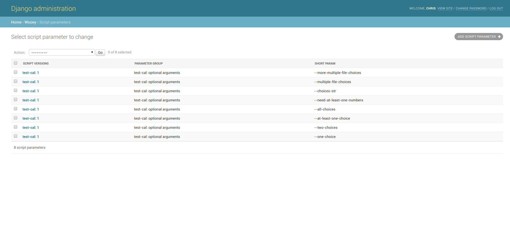

.. _script-parameters-admin:

Script Parameters Admin
=======================

The Script Parameters admin page contains the models that correspond to
the available parameters in a command line tool. Here, users may customize
aspects of how a parameter is exposed in the Web UI and utilized.

Script Versions
---------------

This column corresponds to the different versions of a script the parameter is
associated with. If a script is updated, multiple script versions will be
listed that this parameter is associated with.

Parameter Group
---------------

This corresponds to the group a parameter belongs to. This is exposed in the UI
as the tab a parameter appears under.

Short Param
-----------

This corresponds to the command line argument a parameter is associated with.
