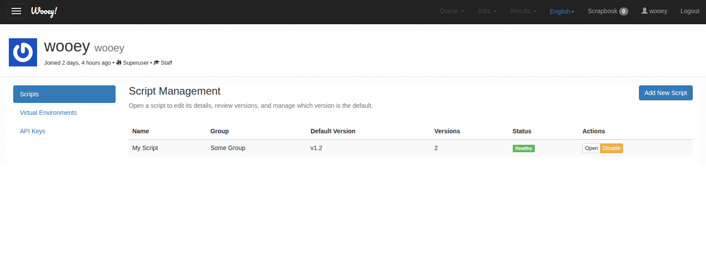

Adding & Managing Scripts
=========================

Scripts may be added in two ways:

* through the staff/admin script management interface in the Wooey profile page
* through the *addscript* command in ``manage.py``

The profile UI is the recommended place to manage scripts day to day. Only
staff/admin users can access the script management interface, the script editor,
or the script-management API endpoints. In Django terms this is any user with
``is_staff=True``, including superusers.

Script Guidelines
-----------------

The easiest way to make your scripts compatible with Wooey is to define
your ArgParse class in the global scope. For instance:

::

    import argparse
    import sys

    parser = argparse.ArgumentParser(description="Find the sum of all the numbers below a certain number.")
    parser.add_argument('--below', help='The number to find the sum of numbers below.', type=int, default=1000)

    def main():
        args = parser.parse_args()
        s = sum((i for i in range(args.below)))
        print("Sum =", s)
        return 0

    if __name__ == "__main__":
        sys.exit(main())

If you have failing scripts, please open an issue with their contents so
we can handle cases as they appear and try to make this as
all-encompasing as possible. One known area which fails currently is
defining your argparse instance inside the
``if __name__ == "__main__"`` block

The Script Management Interface
-------------------------------

Staff/admin users can open their Wooey profile and use the ``Scripts`` tab to
review all uploaded scripts, see the current default version for each one, and
quickly spot problems such as missing active versions.

From this table, staff/admin users can:

* open the script editor for a script
* add a new script
* enable or disable a script
* see the script group, default version, version count, and overall status

Editing Scripts and Versions
----------------------------

Selecting ``Open`` in the ``Scripts`` tab, or clicking a script row, opens the
script editor.

.. image:: img/script_editor_interface.png

The script editor combines script metadata and version management in one place.
Staff/admin users can:

* update the script name, group, description, documentation, display order, and
  active state
* assign a virtual environment to the script
* enable ``ignore_bad_imports`` when a script depends on packages that only
  exist inside its selected virtual environment
* upload a new version of a script and optionally make it the default
  immediately
* switch the default version among active script versions
* enable or disable individual script versions while keeping the upload history
  visible in the UI

The command line
----------------

``./manage.py addscript``

This will add a script or a folder of scripts to Wooey (if a folder is
passed instead of a file). By default, scripts will be created in the
'Wooey Scripts' group.

Script Organization
-------------------

Scripts can be viewed at the root url of Wooey. The ordering of scripts,
and groupings of scripts can be altered by changing the ``Script order`` or the
script group in the script editor.

Script Permissions
------------------

Scripts and script groups can be relegated to certain groups of users.
The 'user groups' option, if set, will restrict script usage to users
within selected groups.

Scripts and groups may also be shut off to all users by unchecking the
``script/group active`` option.

These advanced permission settings still live in the Django admin.

Deleting Scripts
----------------

Scripts may still be deleted from the Django admin interface. When deleting a
script, all related objects, such as previously run jobs, will also be deleted.

Other Script Runners
--------------------

There have been several requests for more advanced script setups, such as executing R code or docker.
For now, there is no official integrations with these languages, but it is possible to create a simple
wrapper script that calls docker or another programming language.

.. toctree::
   :maxdepth: 1

   docker_scripts
