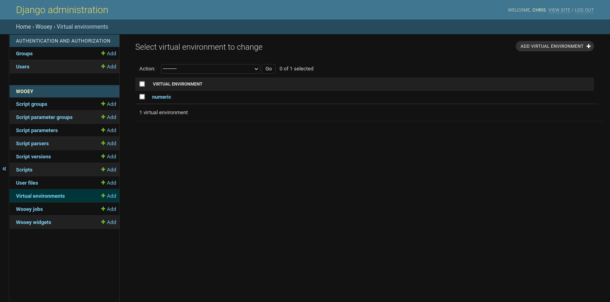
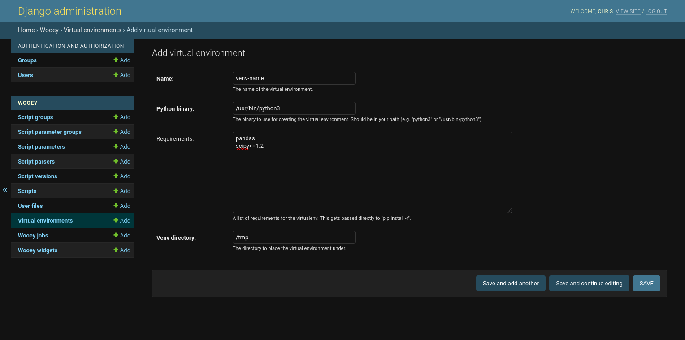
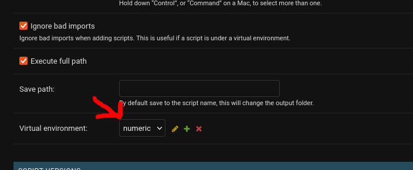
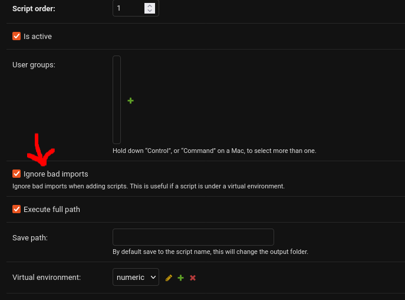

Virtual Environment Setup
=========================

Virtual environments allow you to specify a python interpreter and a set of requirements to run a script in.

Like with script addition, virtual environment setup is done via the Django admin.

Adding a virtual environment
----------------------------

Virtual environments may be setup from the admin under the `Virtual Environments` section:

To add a virtual environment, click the Add button and a form will be rendered for setting up a new virtual environment.

The fields are:

* **name** What to call the virtual environment. Virtual environments can be reused across scripts if desired.

* **python binary** The path to a python executable to create and use for running the virtual environment

* **requirements** This is equivalent to the requirements.txt file for defining packages to install

* **Venv directory** Where to store the virtual environment. The default location for this can be defined via the `WOOEY_VIRTUAL_ENVIRONMENT_DIRECTORY` setting. If not defined, this defaults to the system temporary directory folder.

Lastly, to add the virtual environment to a script, from the script admin view, choose the virtual environment to run
the script in:

Adding scripts with invalid imports
-----------------------------------

Virtual environments are meant to have requirements that may not be present on the main Wooey server. Thus, some
scripts may fail to import because of dependency conflicts. To resolve this, a new option is available on scripts,
`ignore_bad_imports`, that may be set via the admin.

