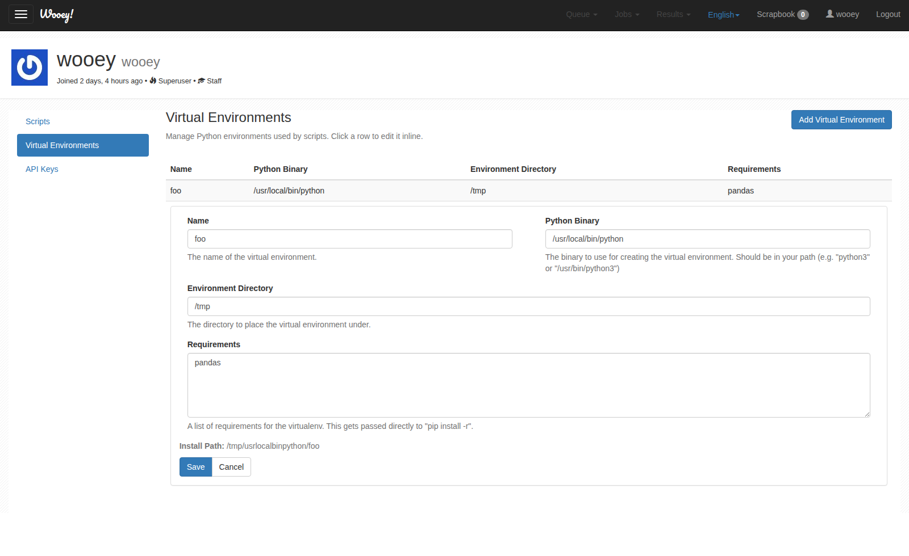
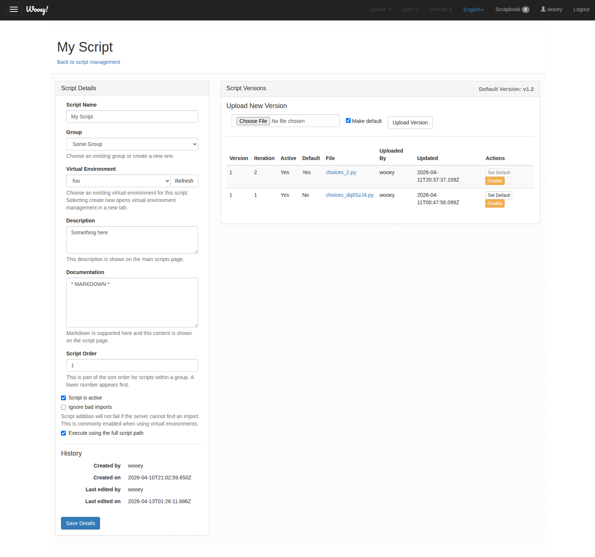

Virtual Environment Setup
=========================

Virtual environments allow you to specify a python interpreter and a set of requirements to run a script in.

Only staff/admin users can create or edit virtual environments. In the web UI,
they are managed from the ``Virtual Environments`` tab on the Wooey profile
page. In Django terms this is any user with ``is_staff=True``, including
superusers.

Managing virtual environments
-----------------------------

Open your profile, switch to the ``Virtual Environments`` tab, then click
``Add Virtual Environment`` to create a new one. Existing rows can be clicked to
edit them inline.

The fields are:

* **name** What to call the virtual environment. Virtual environments can be reused across scripts if desired.

* **python binary** The path to a python executable to create and use for running the virtual environment

* **requirements** This is equivalent to the requirements.txt file for defining packages to install

* **Venv directory** Where to store the virtual environment. The default location for this can be defined via the ``WOOEY_VIRTUAL_ENVIRONMENT_DIRECTORY`` setting. If not defined, this defaults to the system temporary directory folder.

The inline editor also shows the computed install path so you can confirm where
Wooey will create the environment on disk.

Assigning a virtual environment to a script
-------------------------------------------

From the script editor, choose the virtual environment in the ``Virtual
Environment`` dropdown. The ``Refresh`` button reloads the available
environments, and the ``Create new virtual environment...`` option opens the
virtual environment management tab in a new browser tab.

Adding scripts with invalid imports
-----------------------------------

Virtual environments are meant to have requirements that may not be present on the main Wooey server. Thus, some
scripts may fail to import because of dependency conflicts. To resolve this, a new option is available on scripts,
``ignore_bad_imports``, that may be set in the script editor.

When enabled, Wooey will allow the script to be uploaded even if the main server
environment cannot import everything yet. This is especially useful when the
missing packages are installed only inside the selected virtual environment.
